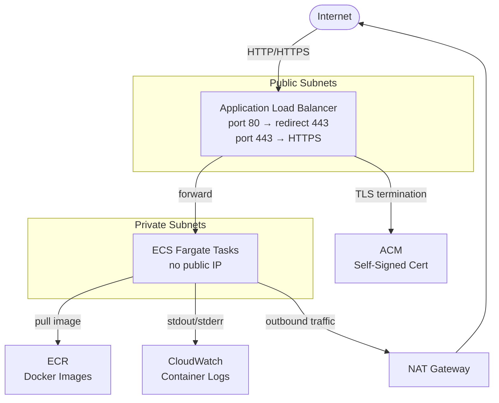

# terraform-aws-ecs-fargate-alb

Deploy a Dockerized web application on AWS using ECS Fargate, Application Load Balancer (ALB), and Terraform.

## Application Repository

The application code and CI/CD pipeline are in a separate repo:
[myapp](https://github.com/markovicivan1987/myapp) — every push to `main` automatically builds, pushes to ECR, and redeploys ECS.

## Architecture



**Traffic flow:** Internet → ALB (public subnets, TLS termination) → ECS Tasks (private subnets) → ECR for image pulls, CloudWatch for logs. Outbound traffic from ECS routes through a NAT Gateway.

## Prerequisites

- AWS account and credentials configured (`aws configure`)
- Terraform >= 1.5
- Docker

## Usage

1. **Clone the repository**
   ```sh
   git clone https://github.com/markovicivan1987/terraform-aws-ecs-fargate-alb.git
   cd terraform-aws-ecs-fargate-alb
   ```

2. **Deploy the infrastructure**
   ```sh
   terraform init
   terraform apply
   ```

3. **Build and push your Docker image**
   ```sh
   aws ecr get-login-password --region us-east-1 | docker login --username AWS --password-stdin $(terraform output -raw ecr_repository_url)
   docker build -t myapp .
   docker tag myapp:latest $(terraform output -raw ecr_repository_url):latest
   docker push $(terraform output -raw ecr_repository_url):latest
   ```

4. **Access the application**
   ```sh
   terraform output alb_https_url
   ```
   > Note: The browser will show a security warning because the certificate is self-signed. This is expected.

## Notes

- ECS tasks run in private subnets with no public IPs; only the ALB is internet-facing.
- NAT Gateway allows ECS tasks to pull images from ECR and reach the internet outbound.
- Port 80 automatically redirects to HTTPS (443).
- The private key is stored in `terraform.tfstate` — do not commit the state file.
